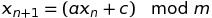

# PRNG
A PRNG (short for Pseudorandom Number Generator) is an algorithm to render number sequences looking random to users but actually being deterministic. It is intended that the PRNG gets close to idealistic random statistical behavior.

## Linear Congruential Generator
The LCG (short for Linear Congruential Generator) is based on the following number sequence.

<!-- math xmlns="http://www.w3.org/1998/Math/MathML">
<mrow><msub>
  <mi>x</mi>
  <mn>n+1</mn>
</msub>
<mo> = </mo>
<mo>(</mo><mi>a</mi>
<msub>
  <mi>x</mi>
  <mn>n</mn>
</msub>
<mo> + </mo>
<mi>c</mi>
<mo>)</mo>
<mo>mod</mo>
<mi>m</mi>
</mrow>
</math -->
<!-- x_{n+1} = ( a x_{n} + c )  \mod m -->

whereas the modulo _m_ defines the **periodicity**, _x0_ is called the **seed** of the number sequence, _a_ being a natural number used as a **multiplier** and _c_ called an **increment**. In case that c equals 0 (zero) the LCG is sometimes referred being a _Park–Miller random number generator_ (after Stephen K. Park and Keith W. Miller) or a _Derrick Henry Lehmer RNG_.

Some basic implementations of LCGs in different programming languages are available in the public domain or other open licensing.

The statistical quality of the LCG strongly depends on choice of the parameters for multiplier a, increment c, and modulo m. Common proposals are described and available in https://en.wikipedia.org/wiki/Linear_congruential_generator and referenced publication listed in there.

Usually due to the number representation of the hardware architecture a specific number range and modulo is targeted and preferred over other values for these parameters. Additionally the number representation as used by the programming language introduces constraints and restrictions to keep the algorithm simple in code.
